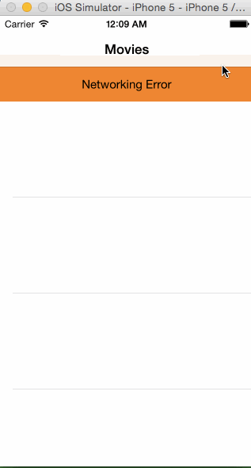

## Rotten Tomatoes

This is a movies app displaying box office and top rental DVDs using the [Rotten Tomatoes API](http://developer.rottentomatoes.com/docs/read/JSON).

I've done only the required steps so far, I'm going to keep working on this on Monday.

Assignment can be found [here](http://courses.codepath.com/courses/intro_to_ios/week/1#!assignment).

Rotten Tomatoes Dummy Data [#1](https://gist.githubusercontent.com/timothy1ee/d1778ca5b944ed974db0/raw/489d812c7ceeec0ac15ab77bf7c47849f2d1eb2b/gistfile1.json)
[#2](https://gist.githubusercontent.com/timothy1ee/e41513a57049e21bc6cf/raw/b490e79be2d21818f28614ec933d5d8f467f0a66/gistfile1.json)

API Key: "av2w54dpqt9fatk3tccb8b9w"

Time spent: 4.34 hours

### Features

#### Required

- [x] User can view a list of movies. Poster images load asynchronously.
- [x] User can view movie details by tapping on a cell.
- [x] User sees loading state while waiting for the API.
- [x] User sees error message when there is a network error: http://cl.ly/image/1l1L3M460c3C
- [x] User can pull to refresh the movie list.

#### Optional

- [ ] All images fade in.
- [ ] For the larger poster, load the low-res first and switch to high-res when complete.
- [ ] All images should be cached in memory and disk: AppDelegate has an instance of `NSURLCache` and `NSURLRequest` makes a request with `NSURLRequestReturnCacheDataElseLoad` cache policy. I tested it by turning off wifi and restarting the app.
- [ ] Customize the highlight and selection effect of the cell.
- [ ] Customize the navigation bar.
- [ ] Add a tab bar for Box Office and DVD.
- [ ] Add a search bar: pretty simple implementation of searching against the existing table view data.

### Walkthrough

GIF created with [LiceCap](http://www.cockos.com/licecap/).

Credits
---------
* [Rotten Tomatoes API](http://developer.rottentomatoes.com/docs/read/JSON)
* [AFNetworking](https://github.com/AFNetworking/AFNetworking)
